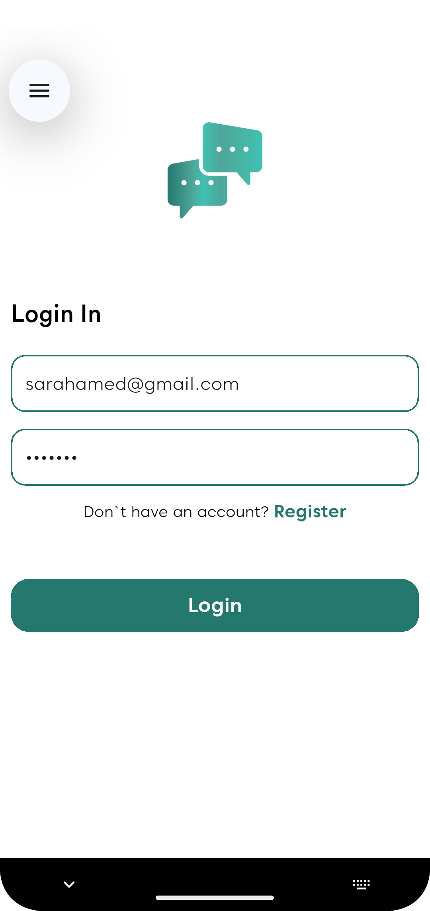
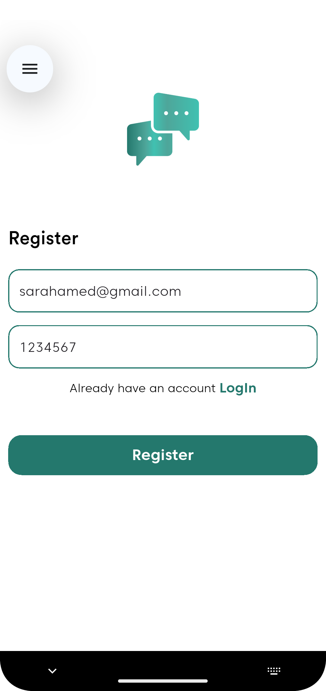

📱 Chat Application

A real-time chat application built with Flutter and Firebase, designed to provide seamless messaging experiences .

## 📸 Screenshots

🛠️ Technologies Used

1. Flutter & Dart
   Flutter: An open-source UI toolkit by Google for building natively compiled applications for mobile, web, and desktop from a single codebase.
   Dart: The programming language used to develop Flutter applications.

2. Firebase Services
   Firebase Authentication: Manages user sign-in and authentication processes.
   Cloud Firestore: A NoSQL cloud database to store and sync data for client- and server-side development. Used for storing chat messages in real-time.
  
3. Additional Tools & Frameworks
   StreamBuilder: A Flutter widget that builds itself based on the latest snapshot of interaction with a Stream, used here to listen to real-time updates from Firestore and display messages accordingly.
   ListView & TextField: Flutter widgets used to display a scrollable list of messages and to input text messages, respectively.

   Custom Widgets:
   ChatBubble: A custom widget designed to display individual chat messages with styling that differentiates between sent and received messages.
   AppText: A custom text widget used for consistent text styling across the application.
   🎨 User Interface Components

